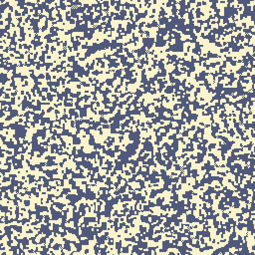

# 3. First rules

*Goal: write rules from scratch, get used to thinking as one cell among many, read your
neighbours, add a slider, and write a minimal render shader.*

*Preset: File → New from template → Tutorial → **Tutorial 3: Majority vote***

## Thinking as a cell

The hardest adjustment in shader programming is not the syntax. It is that your function is not
*the program*; it is one cell's share of the program, and it runs a quarter of a million times
per step with nothing in common between runs but the inputs. You do not loop over the grid. You
do not keep a counter. You answer one question: given my position and the previous generation,
what is my next value?

Load any preset and replace the rule with the smallest one that compiles:

    fn rule(pos: vec2<u32>) -> vec4<f32> {
        return off();
    }

Press Ctrl+Enter. The grid goes black on the next step, because every cell decided to be off.
Now:

    fn rule(pos: vec2<u32>) -> vec4<f32> {
        let x = i32(pos.x);
        let y = i32(pos.y);
        return on_if(alive(x, y));
    }

Nothing changes any more: every cell copies its own previous state. Press Reset to get the
random noise back and watch it stay. This is the identity rule, and it is the skeleton every
other rule in this tutorial grows from. The two conversion lines at the top are explained in
chapter 2; from now on they appear without comment.

## Reading a neighbour

Change the last line to read the cell to the left:

    return on_if(alive(x - 1, y));

Everything scrolls one cell to the right per step. Each cell took its left neighbour's old
value, so the whole picture moved right. Notice what happened at the edges: the column that
fell off the right came back on the left. **Coordinates wrap around**: `alive(-1, y)` reads the
rightmost column, `alive(x, -1)` the bottom row. The grid is a torus. Every helper that takes
coordinates wraps like this, so you never have to check bounds.

Try `alive(x, y - 1)` (scrolls down), `alive(x - 1, y - 1)` (diagonal), `alive(x - 3, y)`
(three cells per step). Try `alive(x * 2, y)`: a weird stretching copy, because wrapping also
applies to coordinates past the far edge.

## Counting neighbours by hand

The helpers you have met return booleans. To count, turn them into numbers:

    let me = u32(alive(x, y));
    let around = u32(alive(x - 1, y)) + u32(alive(x + 1, y))
               + u32(alive(x, y - 1)) + u32(alive(x, y + 1));
    let votes = me + around;    // 0 .. 5

`u32(true)` is `1u`, so `votes` is how many of the cell and its four orthogonal neighbours were
on. Now the first rule with any character, the *majority vote*:

    return on_if(votes >= 3u);

Apply it on a grid of random noise (Grid → init random, density 0.5, then Reset). Within a
handful of steps the noise clots into blobs with smooth edges and then freezes. Each cell has
joined the majority around it; once every cell agrees with its surroundings there is nothing
left to change. It is a tiny model of how opinions, or magnetic domains, settle.

This is the preset's rule, apart from one thing.

## Your first slider

Instead of the fixed `3u`, the preset reads the threshold from a slider. A slider is declared in
a comment and read as a field of `params`:

    // @param threshold: i32 = 3 range 1 .. 5
    ...
    return on_if(votes >= u32(params.threshold));

The comment says: a parameter named `threshold`, of type `i32`, default 3, slider range 1 to 5.
After Apply it appears in the Params panel, and dragging it changes the rule live, without
recompiling. The `u32(...)` conversion is there because the slider is an `i32` and `votes` is a
`u32`, and WGSL will not compare them otherwise (chapter 2).

Drag the threshold to 2: cells turn on when just two of five are on, so the on regions swell
and take over. At 4 the off regions win. Only 3 is balanced. The Grid popover's *density*
slider changes the starting noise; try it with Reset.

Chapter 5 covers all the parameter types; the one-line form above is all you need for now.

## The render shader

So far you have been looking through whatever render shader the preset had. Open the Render
editor. The preset's is the smallest useful one:

    // @param on_colour: vec3<f32> = (0.95, 0.9, 0.6) color
    // @param off_colour: vec3<f32> = (0.08, 0.1, 0.2) color

    fn shade(uv: vec2<f32>, cell: vec4<f32>) -> vec4<f32> {
        return vec4<f32>(mix(params.off_colour, params.on_colour, cell.r), 1.0);
    }

`shade` is called once per pixel of the viewport, not once per cell; `cell` is the cell under
that pixel and `uv` is where the pixel is on the grid, from (0, 0) at the top left to (1, 1) at
the bottom right. It returns a colour: red, green, blue, alpha, each 0 to 1. `mix` blends the
two colours by `cell.r`, which is 0 or 1 here, so each pixel gets exactly one of them. The two
`color` parameters show up as colour pickers.

Two parameters in two editors: all `@param` lines, whichever editor they are in, go into one
shared Params panel.

## Try it

1. **Eight neighbours.** Add the four diagonals to `around` so the vote is over nine cells, and
   change the threshold range to `1 .. 9`. The blobs get rounder.
2. **Minority rule.** Flip the comparison to `votes <= 2u`. Each cell now does the *opposite* of
   its neighbourhood, and the grid flickers in a checkerboard. Why does it never settle?
3. **Copy with a twist.** `on_if(alive(x - 1, y) != alive(x, y - 1))`: a cell turns on when its
   left and upper neighbours disagree. From a single painted cell (Grid → init blank, Reset,
   then click once in the viewport) this draws a Sierpinski triangle, one row per step. That is
   a one-dimensional automaton in disguise, and chapter 8 returns to it.
4. **Debug by colour.** In the render shader, return `gray(f32(cell.g))` ... and nothing
   shows, because this rule never writes `.g`. Store the vote count there instead:
   `return vec4<f32>(f32(votes >= 3u), f32(votes) / 5.0, 0.0, 1.0);` in the rule, and
   `gray(cell.g)` in the render. You are now looking at the neighbour count itself.

## Helpers for rules

For reference, everything a rule can call. All of these read the previous generation and wrap
at the edges.

| Helper | Returns |
|---|---|
| `cell(x, y)` | the full `vec4<f32>` |
| `alive(x, y)` | `cell(x, y).r > 0.5` |
| `neighbours(x, y)` | how many of the 8 surrounding cells are alive (chapter 4) |
| `neighbours4(x, y)` | the same for the 4 orthogonal ones |
| `moore_sum(x, y)` | the `vec4<f32>` sum of the 8 neighbours |
| `laplacian(x, y)` | a 9-point Laplacian, for diffusion (chapter 7) |
| `on()`, `off()`, `on_if(flag)` | cell values |
| `noise(pos)`, `rand(pos, salt)` | random numbers (chapter 6) |
| `prev_cell(x)`, `prev_alive(x)` | the previous row, in 1D mode (chapter 8) |
| `neighbours_hex`, `neighbours_tri`, `neighbours_tri12` | other grids (chapter 9) |
| `other(x, y)`, `other_alive(x, y)` | layer B's cell (chapter 9) |

## What you learned

A rule is one cell's answer, computed from the previous generation through helpers that wrap
around the edges. Booleans become counts through `u32()`. A `// @param` line makes a slider
that the shader reads as `params.name`. The render shader turns a cell into a colour per pixel.
Next: the rule everyone knows.

[← WGSL essentials](02-wgsl-essentials.md) · [Next: Life →](04-life.md)
