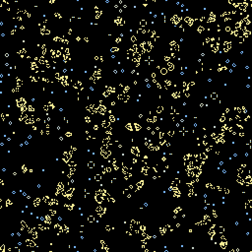

# 4. Life

*Goal: implement Conway's Game of Life, understand birth and survival rules and why small
changes to them matter, use a spare channel as memory, and get comfortable with painting,
stepping and rewinding.*

*Preset: File → New from template → Tutorial → **Tutorial 4: Life***

## The rule

In 1970 John Conway was looking for the simplest rule that was neither boring nor explosive.
He found one with two states and the eight-cell neighbourhood (the *Moore* neighbourhood):

- A live cell with two or three live neighbours **survives**; otherwise it dies, of loneliness
  or overcrowding.
- A dead cell with exactly three live neighbours is **born**.

Everything else stays as it is. In the compact notation used for this family of rules it is
**B3/S23**: born with 3, survives with 2 or 3.

Chapter 3 counted neighbours by hand. The `neighbours(x, y)` helper does the eight-cell count
for you, and the rule is a direct transcription of the two sentences:

    fn rule(pos: vec2<u32>) -> vec4<f32> {
        let x = i32(pos.x);
        let y = i32(pos.y);
        let n = neighbours(x, y);
        let me = alive(x, y);

        let survives = me && (n == 2u || n == 3u);  // S23
        let born = !me && n == 3u;                  // B3
        let next = survives || born;

        let age = select(0.0, cell(x, y).g + 1.0, next && me);
        return vec4<f32>(f32(next), age, 0.0, 1.0);
    }

Apply it on random noise at density 0.3. The chaos settles over a few hundred steps into a
litter of *still lifes* (blocks, beehives, loaves), *oscillators* (blinkers, toads, pulsars) and
*gliders*, five-cell patterns that crawl diagonally across the grid forever. Life is famous
because this zoo is enormous: there are glider guns, puffers, spaceships of many speeds, and
patterns that emulate logic gates and, eventually, computers. The rule is also *undecidable* in
the formal sense: no shortcut exists for predicting what an arbitrary pattern will do, other
than running it.

## Using a spare channel as memory

The last two lines do something Life itself does not need. Besides `.r` for alive, the rule
keeps in `.g` how many steps the cell has been alive:

    let age = select(0.0, cell(x, y).g + 1.0, next && me);

If the cell was alive and stays alive, its age is the old age plus one; otherwise it is zero.
The render shader colours by it, so you can see which structures are old and stable and which
are still churning:

    let t = clamp(cell.g / params.fade, 0.0, 1.0);
    let colour = mix(params.young, params.old, t) * cell.r;

Newborn cells are warm, cells that have sat still for `fade` steps are cool, and dead cells are
black because of the `* cell.r`. This is a pattern you will use again and again: the rule
records something in an unused channel purely so that the render shader can show it. The
channel is memory that the cell carries from step to step; it is the only memory a cell has.

## Painting and stepping

Pause with Space. Right-drag to erase a patch, then paint a glider with the left button, one
click per cell:

    . X .
    . . X
    X X X

Press Step a few times and watch it move down and to the right, one cell every four steps.
The brush toolbar that appears over the viewport sets the brush radius and the value it paints
(the default is `on()`). Press Space to let it run.

Now paint a line of three cells and step: it flips between horizontal and vertical. That is the
blinker, the simplest oscillator. A two-by-two block does nothing at all: a still life.

## Rewinding

The timeline under the viewport collects snapshots every few steps. Drag its slider to go back,
look, and press Play to continue from there, which replaces what came after. Reset clears it.
It is useful whenever something interesting flashed by.

## Changing the rule

The whole Life-like family is one line away. Edit the two marked lines:

| Rule | Birth | Survival | Character |
|---|---|---|---|
| Life B3/S23 | `n == 3u` | `n == 2u \|\| n == 3u` | balanced, gliders |
| HighLife B36/S23 | `n == 3u \|\| n == 6u` | same | has a *replicator* that copies itself |
| Seeds B2/S | `n == 2u` | `false` | every cell dies at once; explosive growth |
| Day & Night B3678/S34678 | 3, 6, 7, 8 | 3, 4, 6, 7, 8 | symmetric: on and off swap roles |
| Diamoeba B35678/S5678 | 3, 5, 6, 7, 8 | 5, 6, 7, 8 | large amoeba-like blobs |
| Maze B3/S12345 | 3 | 1 to 5 | grows mazes |

Seeds and Day & Night are worth a look just to see how different a near-identical rule can
behave. For exploring systematically there are two tools in the app: the *Life-like with B/S
switches* template has one checkbox per neighbour count, and **View → Rule explorer** shows
sixteen random rules running live.

That template, and the rule explorer, encode the rule as bit masks instead of comparisons: bit
`n` of `birth` set means "born with n neighbours".

    const BIRTH: u32 = 8u;      // 0b000001000: bit 3
    const SURVIVE: u32 = 12u;   // 0b000001100: bits 2 and 3
    let mask = select(BIRTH, SURVIVE, me);
    let next = ((mask >> n) & 1u) == 1u;

Shift the mask right by `n` and look at the lowest bit. It is the same trick chapter 8 uses for
one-dimensional rule numbers, and it is how a rule becomes *data* that a slider can change.

## Try it

1. **Brian's Brain.** Three states: off, *firing* and *refractory*. A firing cell always becomes
   refractory, a refractory cell always becomes off, and an off cell fires when exactly two of
   its neighbours are firing. Store firing as `.r = 1.0` and refractory as `.r = 0.5`: since
   `alive()` tests `.r > 0.5`, `neighbours()` counts only firing cells, which is what you want.

       let c = cell(x, y);
       let n = neighbours(x, y);
       if (c.r > 0.75) { return vec4<f32>(0.5, 0.0, 0.0, 1.0); }   // firing -> refractory
       if (c.r > 0.25) { return off(); }                           // refractory -> off
       return on_if(n == 2u);                                      // off -> firing

   Colour the three states differently in the render shader. Brian's Brain never settles; it
   is all spaceships.
2. **Life with memory.** Make dying cells leave a trace: set `.b` to 1.0 the step a cell dies
   and multiply it by 0.95 every step after. Colour by `.b`. This is the *ember* channel of the
   next chapter's preset.
3. **Generations.** Give dying cells a countdown: on death set `.g` to, say, 8, decrement each
   step, and treat cells with a positive countdown as neither alive nor available for birth.
   You have reinvented the *Generations* family of rules (Star Wars is B2/S345 with 4 states).
4. **Break it.** Change `n == 3u` to `n == 3`. Still compiles: the literal adapts. Now change it
   to `n == params.fade`. Read the error, then fix it.

## What you learned

Life is B3/S23 with the eight-cell neighbourhood. Birth and survival conditions are the dials of
a whole family of rules, and bit masks turn those dials into data. A cell's spare channels are
its only memory, and recording things there for the render shader is standard practice.
Painting, Step and the timeline are how you experiment.

[← First rules](03-first-rules.md) · [Next: Colour and sliders →](05-colour-and-sliders.md)
