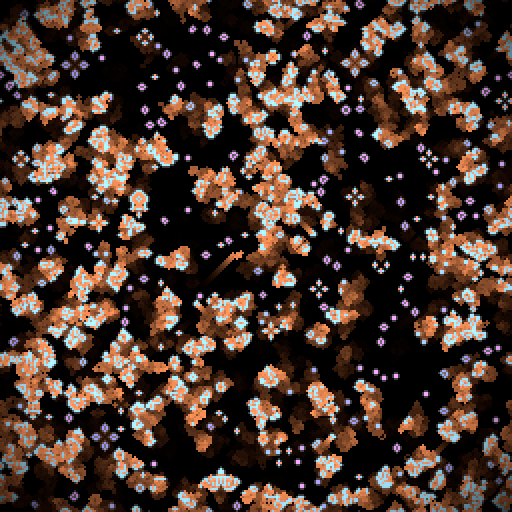

# 5. Colour and sliders

*Goal: get fluent with the render shader, learn the colour helpers, read neighbouring cells by
coordinate, animate with time, and declare every kind of parameter.*

*Preset: File → New from template → Tutorial → **Tutorial 5: Colour and sliders***

## Pixels, not cells

The rule shader runs per cell. The render shader runs per *pixel of the viewport*, and there are
usually many more pixels than cells or, when you zoom out, fewer. Each invocation of `shade`
gets two things:

- `uv`, its position on the grid as a fraction: `(0.0, 0.0)` top left, `(1.0, 1.0)` bottom
  right, `(0.5, 0.5)` the centre. It is the same for a pixel whatever the grid size.
- `cell`, the value of the cell under that pixel. The app finds it for you.

It returns the pixel's colour, a `vec4<f32>` of red, green, blue and alpha in 0 to 1. Values
above 1 are clipped to white; negative values to black.

The render shader is read-only. It cannot write to a cell, and it runs once per frame no matter
how many steps per frame the rule runs. Anything that should affect the simulation belongs in
the rule; anything that is only about appearance belongs here. The preset keeps this split: the
rule is plain Life plus an *ember* channel (`.b` is set to 1 when a cell dies and decays by a
factor every step), and all the looks are in the render.

## Colour helpers

| Helper | Returns |
|---|---|
| `gray(t)` | a `vec4<f32>` grey, `t` clamped to 0..1 |
| `rgb(r, g, b)` | a `vec4<f32>` with alpha 1 |
| `hsv(h, s, v)` | a `vec3<f32>` from hue (0..1 around the wheel), saturation and value |
| `palette(t)` | a `vec3<f32>` from a smooth, pleasant built-in gradient for `t` in 0..1 |
| `cell_at(x, y)` | another cell, by grid coordinate, wrapping |

`hsv` is the one to reach for when you want "a colour that changes smoothly with some
quantity": vary the hue with age, position or time and keep saturation and value fixed.
`fract()` keeps a drifting hue inside 0..1. `palette` gives a nicer-looking ramp than a plain
`mix` between two colours, and `mix` is still right when you have two specific colours in mind.

## The preset's render shader, line by line

    let age = clamp(cell.g / 60.0, 0.0, 1.0);
    var colour = hsv(fract(params.hue + age * 0.25), 0.7, 1.0) * cell.r;

Age in steps becomes a 0..1 number, which turns the hue by up to a quarter of the wheel from the
`hue` slider. Multiplying by `cell.r` blacks out dead cells. `colour` is a `var` because the
following lines add to it.

    colour += params.ember_colour * cell.b * (1.0 - cell.r);

Dead cells show the ember the rule left in `.b`, scaled by how bright the ember still is.

    let p = vec2<i32>(uv * vec2<f32>(globals.size));
    let around = (cell_at(p.x - 1, p.y).r + cell_at(p.x + 1, p.y).r
        + cell_at(p.x, p.y - 1).r + cell_at(p.x, p.y + 1).r) * 0.25;
    colour += vec3<f32>(params.glow * around * 0.5);

To read neighbouring cells you need grid coordinates, and `uv` times the grid size gives them.
`globals.size` is a `vec2<u32>`, so it is converted to float for the multiplication and the
result to `vec2<i32>` for `cell_at`. The average of the four neighbours' alive values is added
as a glow: pixels next to live cells brighten.

    colour *= 1.0 + params.pulse * 0.3 * sin(globals.time * 3.0);

`globals.time` is seconds since Reset, and it keeps running while the simulation is paused, so
render effects can animate a frozen grid. The multiplier breathes between 0.7 and 1.3 when
`pulse` is 1.

    if (params.vignette != 0u) {
        let d = distance(uv, vec2<f32>(0.5));
        colour *= 1.0 - smoothstep(0.4, 0.75, d);
    }

A `bool` parameter arrives in the shader as a `u32`, 0 or 1, hence the `!= 0u`. The vignette
darkens pixels by their distance from the centre of the viewport, with `smoothstep` giving a
soft falloff from radius 0.4 to 0.75.

## Parameters in full

A parameter is a comment line at the start of a line, in any editor:

    // @param name: type = default
    // @param name: type = default range lo .. hi
    // @param name: vec3<f32> = (r, g, b) color

| Type | Default looks like | Widget | Read in WGSL as |
|---|---|---|---|
| `f32` | `0.5` | slider (or a drag field without a range) | `params.name` (`f32`) |
| `i32` | `3` | integer slider | `params.name` (`i32`) |
| `bool` | `true` | checkbox | `params.name != 0u` (`u32`) |
| `vec2<f32>` | `(0.1, 0.2)` | two drag fields | `params.name.x` |
| `vec3<f32>` | `(1, 0.5, 0.2)` | three fields, or a colour picker with `color` | `params.name.rgb` |
| `vec4<f32>` | `(1, 2, 3, 4)` | four fields, or a colour picker with alpha | `params.name` |

Rules of the game:

- Names must be plain identifiers (`letters_digits_underscores`) and not WGSL keywords.
- Every `@param` from every editor lands in one shared panel and one shared `params` struct,
  so the rule and the render can read the same slider. Declaring the same name twice with
  different types is an error.
- At most 32 parameters in total.
- Values survive re-applies as long as the name and type stay the same, so you can edit code
  without losing your slider settings. They are saved with the preset.
- Each numeric slider has a **~** button for modulation (chapter 9), and the Params panel's
  **Mutate** button nudges every value at random, with Undo.

## Try it

1. **Grid lines.** `let g = fract(uv * vec2<f32>(globals.size));` is each pixel's position
   inside its cell. Darken pixels where `g.x < 0.1 || g.y < 0.1`. Zoom the window to see them.
2. **Heat map.** In the rule, store `f32(neighbours(x, y)) / 8.0` in `.b`; in the render,
   `palette(cell.b)`. You are looking at the crowding of each cell.
3. **Position colouring.** Hue from `uv.x`, so the same automaton shows a rainbow across the
   grid. Then from `atan2(uv.y - 0.5, uv.x - 0.5)` for a radial one.
4. **A wrong type.** Declare `// @param speed: i32 = 3` and write `sin(globals.time *
   params.speed)`. Read the error. Fix it with `f32(params.speed)`, or change the parameter type.
5. **Post, briefly.** Open the Post editor and change `return color;` to
   `return mix(color, prev(uv), 0.8);`. The whole picture now trails. That is chapter 9's
   subject; put it back for now.

## What you learned

The render shader maps the cell under a pixel, and the pixel's position, to a colour, and it
can read other cells by grid coordinate. `hsv`, `palette` and `mix` cover most colouring needs,
`globals.time` animates, and `smoothstep` softens. Parameters come in six types, live in one
shared panel, and keep their values across edits.

[← Life](04-life.md) · [Next: Randomness and seeds →](06-randomness-and-seeds.md)
