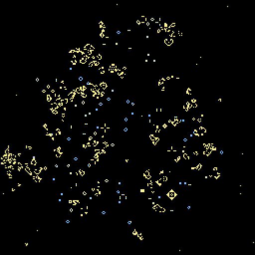

# 6. Randomness and seeds

*Goal: understand how a shader gets random numbers without a random number generator, write
rules with chance in them, keep runs reproducible, and write the grid's starting state as code.*

*Preset: File → New from template → Tutorial → **Tutorial 6: Randomness and seeds***

## Random numbers without state

A normal random number generator keeps state: each call advances it. A shader invocation has
no state and no idea what the other invocations are doing, so there is no `rand()` to call. The
GPU answer is *hashing*: a function that turns a few integers into one that looks random, with
no pattern a human can see. Feed it the cell's position, the step number and a seed, and every
cell on every step gets a different, reproducible number.

The app provides two forms:

    noise(pos)         // a fresh number in 0..1 for this cell on this step
    rand(pos, salt)    // a number in 0..1 for this cell that is the same on every step

`noise` mixes in `globals.frame`, so it changes every step; use it for chance events. `rand`
mixes in only the `salt` you give it; use it for fixed per-cell patterns, like "this cell's
personal threshold". Different salts give unrelated numbers for the same cell.

Both also mix in `globals.seed`, which is the **seed** field in the Grid popover. Change it
(the dice button picks a new one) and press Reset: a different history. Leave it and press
Reset: exactly the same history, step for step. GPUs are deterministic, hashing is
deterministic, so the only source of variation is the seed, which is a very good property for
debugging and for sharing: a preset's seed is saved with it, and a share link reproduces a scene
exactly.

The Grid popover's *auto-reseed when stuck* option watches the statistics and, when the grid
has been static or periodic for two seconds, resets with a new seed. It is handy for rules that
die out or freeze.

## A rule with chance in it

The preset's rule is Life with one addition:

    let spark = !me && noise(pos) < params.spark;
    let next = survives || born || spark;

Each dead cell has a tiny probability `spark` of being born out of nothing. `noise(pos)` is
uniform in 0..1, so comparing it with a probability is the standard way to say "with
probability p". With `spark` at 0.0002 and 65,536 cells, about thirteen cells spark per step,
which is enough to keep Life from ever dying out completely and little enough not to swamp
it. Drag the slider up and Life turns to static; down to zero and it is Life again.

Chance is a powerful ingredient. A few classic probabilistic automata to try in the rule editor:

**Forest fire.** Cells are empty, tree or burning. Trees grow in empty cells with probability
`grow`, a tree next to fire catches fire, a tree is struck by lightning with probability
`lightning`, and a burning tree becomes empty. Store tree in `.r` and burning in `.g`:

    // @param grow: f32 = 0.01 range 0.0 .. 0.05
    // @param lightning: f32 = 0.0001 range 0.0 .. 0.001
    fn rule(pos: vec2<u32>) -> vec4<f32> {
        let x = i32(pos.x);
        let y = i32(pos.y);
        let c = cell(x, y);
        let fire_near = moore_sum(x, y).g > 0.5;
        if (c.g > 0.5) { return off(); }                              // burnt down
        if (c.r > 0.5) {                                              // a tree
            if (fire_near || noise(pos) < params.lightning) {
                return vec4<f32>(1.0, 1.0, 0.0, 1.0);                 // catches fire
            }
            return c;
        }
        return on_if(noise(pos) < params.grow);                       // empty: maybe a sapling
    }

`moore_sum` adds up the eight neighbours' whole cells, so its `.g` is the number of burning
neighbours. Colour trees green and `.g` orange in the render shader. The ratio of `grow` to
`lightning` sets the size of the fires: the model is a standard example of self-organised
criticality, with fires of every size.

**Noisy majority.** Chapter 3's majority vote froze. Add `|| noise(pos) < 0.01` as a chance of
flipping and it never does, but keeps the blobby look: a model of a magnet at a temperature.

**Random walkers.** Rules where cells move at random are awkward in a synchronous automaton,
because two walkers may step into the same cell. The usual trick is to decide from the
*destination*: a cell becomes occupied if a neighbour "chose" to move into it, where the choice
is a `rand` or `noise` evaluated at the neighbour's position, so both cells compute the same
decision. Try it after the chapter; it is a good exercise in the per-cell mindset.

## Seeding the grid

The Grid popover's **init** chooses what Reset fills the grid with:

- **random**: each cell on with probability *density*. Good for soups.
- **blank**: all off. Paint your own.
- **single** (1D mode only): one live cell in the middle of the first row, the classic start for
  an elementary automaton. In 2D a lone cell dies at once, so it is not offered there.
- **code**: a fourth shader, in the **Seed** editor, computes every cell's starting value.

Choosing *code* for the first time fills the Seed editor with a starter you can edit. The
function is `fn seed(pos: vec2<u32>) -> vec4<f32>`, and it has everything the rule has
(`on_if`, `rand`, `params`, `globals.size`) plus a few helpers for drawing:

| Helper | Meaning |
|---|---|
| `centred(pos)` | the position relative to the middle of the grid, as `vec2<i32>` |
| `in_box(p, origin, size)` | inside the box with that top-left corner and size, in cells |
| `in_disc(p, centre, radius)` | within `radius` cells of `centre` |
| `row_bit(row, x, width)` | column `x` of a pattern row written as bits, most significant first |
| `chance(pos, p)` | true for a fraction `p` of the cells, following the Grid's seed |

The seed runs once per cell when you press Reset, so edits to it show after **Apply & reset**
in its editor (a plain Apply compiles it for the next Reset). Sliders declared in the seed work
like any other and also take effect on Reset.

## The preset's seed

    const R_PENTOMINO = array<u32, 3>(
        0x3u, // .XX
        0x6u, // XX.
        0x2u  // .X.
    );

A small pattern is easiest to draw as rows of bits. WGSL has no binary literals, so each row is
written in hex with the picture alongside: `0x6u` is `110`, the row `XX.`. Three bits wide,
three rows.

    let p = centred(pos);
    let q = p + vec2<i32>(1, 1);
    if (q.y >= 0 && q.y < 3 && row_bit(R_PENTOMINO[q.y], q.x, 3)) {
        return on();
    }

`p` is the cell's position relative to the centre, so the pattern's top-left corner at `q = (0,
0)` means `p = (-1, -1)`: one up and left of the middle. `row_bit` reads column `q.x` of row
`q.y`, and returns false outside the row's width, so only `q.y` needs checking. The
R-pentomino is a *methuselah*: five cells that keep Life busy for 1103 generations before
settling, throwing off six gliders on the way.

    let r = length(vec2<f32>(p));
    if (r > 60.0 && r < 80.0 && chance(pos, params.ring_density)) {
        return on();
    }
    return off();

Around it, a ring of random cells, so the pentomino's debris has something to run into.
`chance` follows the Grid's seed, so the same seed gives the same ring.

Larger patterns do not fit in 32 bits per row; the built-in *Glider Gun* preset lists its cells
as coordinates instead and checks them in a loop, and *Acorn* is another bit-row methuselah. A
seed can also write continuous values rather than `on()`/`off()`, which is how the next
chapter starts its chemistry.

## Images and painting

Two more ways to start. **Image → Seed grid from image…** (or dropping a PNG onto the window)
resamples a picture onto the grid, either thresholding brightness into live cells or copying
the colour channels into the cell channels. And painting always works, including while paused,
with the brush value set to whatever four numbers the rule needs.

## Try it

1. **Two pentominoes.** Seed a second R-pentomino 40 cells to the right of the first and watch
   them collide. Then flip one of them (read the row from the other end: `2 - q.x`).
2. **A glider.** Draw a glider as three bit rows and point it at the ring.
3. **Personal thresholds.** Back in the rule, give each cell its own survival requirement:
   `let picky = rand(pos, 7u) < 0.1;` and let picky cells need exactly three neighbours to
   survive. A fixed, random 10 % of cells now behave differently, forever.
4. **Seeded density.** Replace the ring with `chance(pos, params.ring_density)` everywhere and
   you have reimplemented the *random* init, with the slider in the Params panel instead of the
   Grid popover.

## What you learned

Shaders get randomness by hashing position, step and seed, which makes every run reproducible
from its seed. `noise(pos) < p` is "with probability p". The start state can be random, blank,
painted, taken from an image, or computed by a seed shader with shape helpers and bit-row
patterns. Next: cells that are amounts rather than bits.

[← Colour and sliders](05-colour-and-sliders.md) · [Next: Continuous states →](07-continuous-states.md)
