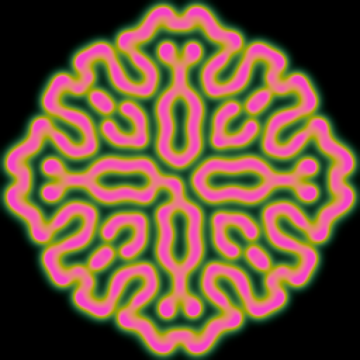

# 7. Continuous states

*Goal: move from bits to amounts, understand diffusion and the Laplacian, know why a simulation
blows up and how to keep it stable, and build the Gray-Scott reaction-diffusion model.*

*Preset: File → New from template → Tutorial → **Tutorial 7: Reaction-diffusion***

## Amounts instead of bits

Every cell has been a `vec4<f32>` all along; the on/off automata just never used anything but
0 and 1. Nothing stops a cell from holding 0.37. Once it does, the natural rules are not "born"
and "dies" but "a little more" and "a little less": the cell's value nudges towards something
each step, and the automaton becomes a numerical simulation of a physical process.

The simplest such process is **diffusion**: stuff spreads from where there is more to where
there is less. Ink in water, heat in a pan. In a grid, a cell with more than its neighbours
should lose a little and a cell with less should gain a little. The quantity that says "how
much more do my neighbours hold than I do" is the **Laplacian**, and the app computes it for
you:

    let lap = laplacian(x, y);   // vec4<f32>, one value per channel

It is a weighted sum: the four orthogonal neighbours with weight 1, the four diagonals with
weight 0.5, and the cell itself with weight minus 6, which is minus the total of the others. In
a flat region it is zero. Where the cell is lower than its surroundings it is positive, where
higher it is negative. Diffusion is then one line:

    let v = c.r + k * lap.r;

With `k` positive, the cell moves towards the local average by a fraction. Try it: in a fresh
preset, make the rule

    fn rule(pos: vec2<u32>) -> vec4<f32> {
        let x = i32(pos.x);
        let y = i32(pos.y);
        let c = cell(x, y);
        let lap = laplacian(x, y);
        return vec4<f32>(c.r + 0.15 * lap.r, 0.0, 0.0, 1.0);
    }

with `gray(cell.r)` in the render, on random noise. The noise blurs into a smooth grey mush in
a few dozen steps. That is diffusion, and the first ingredient.

## Stability, or why it blows up

Set `k` to 0.3 instead of 0.15 and apply. Within a few steps the grid erupts into a
checkerboard of extreme values and the picture is garbage. Nothing is wrong with the GPU. The
simulation has become **unstable**.

The reason is worth understanding, because it governs every continuous rule you will write. A
step of diffusion multiplies each spatial frequency of the picture by a factor. For the
smoothest patterns the factor is close to 1 (they barely change) and for the roughest, a
checkerboard, it is `1 - 8k` with this Laplacian's weights. As long as that factor is between
minus one and one, every pattern shrinks or holds; the moment `k` exceeds 0.25 the factor drops
below minus one and the checkerboard *grows*, flipping sign every step, until the floats
overflow. The stable range for this stencil is `k` at most 0.25, with values near the limit
oscillating as they decay. Smaller is smoother.

Three habits follow from this:

- Keep diffusion rates small, and when you need faster spreading, run more **steps per frame**
  rather than a larger `k`. The preset runs 8 steps per frame.
- `clamp` the state to a sane range at the end of the rule. It does not make an unstable scheme
  stable, but it keeps a wobble from becoming infinities that poison every neighbour.
- When a continuous simulation turns to checkerboards or stripes, the first suspect is a rate
  that is too large.

## Reaction

Diffusion alone only ever smooths. The interesting patterns come from adding a **reaction**:
some local process that creates or destroys the chemicals depending on how much of each is
present. In 1983 Gray and Scott studied one with two substances:

    U + 2V -> 3V      V eats U and makes more V
    V -> P            V decays into an inert product

together with a constant supply of U. Alan Turing had shown in 1952 that such systems, with two
chemicals diffusing at different rates, can turn a uniform mixture into spots and stripes, which
is a leading explanation for animal coat patterns. The Gray-Scott version is the one everybody
simulates because it produces an astonishing range of behaviour from two numbers.

The preset stores U in `.r` and V in `.g`. Each step:

    let u = c.r;
    let v = c.g;
    let reaction = u * v * v;
    let next_u = u + params.du * lap.r - reaction + params.feed * (1.0 - u);
    let next_v = v + params.dv * lap.g + reaction - (params.feed + params.kill) * v;
    return vec4<f32>(clamp(next_u, 0.0, 1.0), clamp(next_v, 0.0, 1.0), 0.0, 1.0);

Read the U line term by term: diffusion at rate `du`; minus the reaction (U is consumed, and
the reaction needs one U and two V, hence `u * v * v`); plus a *feed* that tops U up towards 1
at rate `feed`. The V line: diffusion at the slower rate `dv`; plus the same reaction (V is
produced); minus a drain at rate `feed + kill` (V is washed out with the feed flow and also
decays). The clamps are the stability habit.

The two interesting numbers are `feed` and `kill`. Different pairs give qualitatively different
worlds:

| feed | kill | What grows |
|---|---|---|
| 0.037 | 0.060 | branching coral-like fronts (the preset's default) |
| 0.025 | 0.060 | worms that wriggle and split |
| 0.030 | 0.062 | spots that divide like cells (*mitosis*) |
| 0.055 | 0.062 | dense coral |
| 0.014 | 0.054 | moving spots that annihilate on contact |
| 0.040 | 0.060 | labyrinths |

Change them with the sliders while it runs; some transitions take a minute to show. Press
Reset to grow a new pattern from the seed with the new numbers.

## Seeding a continuous system

A Gray-Scott world starts as a bath of U with a little V somewhere. The preset's seed shader
writes the two channels directly:

    var v = 0.0;
    if (in_box(p, vec2<i32>(-params.square), vec2<i32>(2 * params.square))) {
        v = 1.0;
    }
    v += rand(pos, 1u) * 0.02;
    return vec4<f32>(1.0 - 0.5 * v, v, 0.0, 1.0);

A square of V in the middle, a sprinkle of noise everywhere so the pattern does not stay
symmetric, and U reduced where V is present. `vec2<i32>(-params.square)` is a vector with both
components equal, a shorthand you will see often. The `square` slider is declared in the seed
and sets the size on the next Reset.

Remember that the rule has no notion of on or off here, so painting with the default brush
(`on()` = U 1, V 0) *erases*; set the brush value to `0, 1, 0, 1` to add V.

## Rendering a continuous value

V stays small, a few tenths at most, so the render multiplies it by a `gain` before colouring:

    let t = clamp(cell.g * params.gain, 0.0, 1.0);
    let colour = palette(fract(params.shift + t * 0.5)) * t;

`palette` maps 0..1 to a smooth gradient and `shift` rotates it; multiplying by `t` keeps the U
bath dark. The useful habit is to render *whatever channel you are reasoning about*: switch to
`gray(cell.r)` to see U instead, or `gray(abs(lap.g) * 20.0)` computed in the render with
`cell_at` to see where the reaction front is.

## Try it

1. **Diffusion with growth.** `v += 0.05 * v * (1.0 - v) * (v - 0.3)` after the diffusion
   line: values above 0.3 grow towards 1, values below fade to 0. Blobs with sharp edges form
   from noise. This is the *2D continuous* template's physics.
2. **Three chemicals.** Add a third substance in `.b` that is produced where V is high and
   diffuses faster than both. Colour each channel differently.
3. **Smooth Life.** Diffuse `.r` with `k = 0.2`, then `return on_if(v > 0.5)`: a threshold
   after smoothing. Vary the threshold.
4. **Find the edge.** Drag `du` towards 0.25 and above while it runs and watch the stability
   limit arrive.
5. **Mutate.** The Params panel's Mutate button nudges every slider a little at random. Press it
   a few times on Gray-Scott, then Undo your way back to the one you liked.

## What you learned

Continuous cells hold amounts, and rules nudge them. `laplacian` measures how a cell differs
from its surroundings and `c + k * lap` is diffusion, stable for `k` up to 0.25 with this
stencil; use steps per frame, not a larger rate, to go faster, and clamp. Adding a local
reaction gives reaction-diffusion, and Gray-Scott's `feed` and `kill` select among worms, spots,
coral and mazes. Seeds and brushes write channel values directly.

[← Randomness and seeds](06-randomness-and-seeds.md) · [Next: One dimension →](08-one-dimensional.md)
