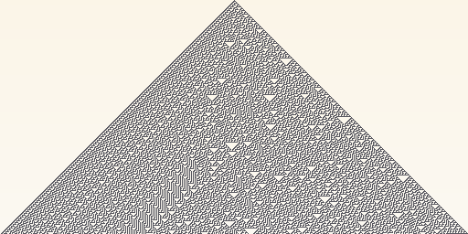

# 8. One dimension

*Goal: understand space-time diagrams and the app's 1D mode, implement Wolfram's elementary
automata from their rule numbers, and build a continuous one-dimensional system.*

*Preset: File → New from template → Tutorial → **Tutorial 8: One dimension***

## Space-time diagrams

A one-dimensional automaton is a row of cells. Each step produces a new row from the old one.
Showing just the current row would be dull, so the convention is to stack the rows: time runs
downward, and the picture is the whole history at once, a *space-time diagram*. The triangle in
the image above is 255 generations of Rule 30, started from a single cell in the top row.

In the app, **Grid → mode → 1D (space-time)** switches to this. The grid is still a texture of
`width` by `height` cells, but a step now computes only one new row, just below the previous
one, and once the bottom is reached the diagram scrolls up so the newest row is always at the
bottom. The preset is 512 cells wide with 256 rows of history.

## What a 1D rule can see

`rule` is still called with a `pos`, but only for the cells of the row being written, and the
previous generation is the *row above*. Two helpers read it:

    prev_alive(x)   // was column x on in the previous row?
    prev_cell(x)    // its full vec4<f32>

Do not read the previous row with `cell(x, y - 1)`. It works until the diagram scrolls; after
that the row being written stays at the bottom while the rows above shift, and `y - 1` is no
longer the previous generation. `prev_alive` and `prev_cell` always read the right row, whatever
the scrolling is doing. (For the curious: `globals.row` is the row being written and
`globals.prev_row` the one being read.)

The Grid's **single** init puts one live cell in the middle of the first row. It only exists in
1D mode because a lone cell in Life dies immediately, whereas most 1D rules grow a triangle
from it. A **code** seed also works in 1D: `seed` is called for the first row only, with
`pos.y == 0`, so use `pos.x` or `centred(pos).x`.

## Elementary automata and rule numbers

The simplest one-dimensional rules look at three cells of the previous row: the one above-left,
the one directly above and the one above-right. Three binary cells make eight possible patterns,
and a rule is a choice of which of those eight patterns produce a live cell. Eight yes/no
choices make 256 rules. Stephen Wolfram numbered them: write the eight answers as the bits of
a byte, with pattern `111` as the most significant bit and `000` as the least, and the byte's
value is the rule number.

Rule 30 is 30 = `00011110` in binary. Bit 0 (pattern `000`) is 0: three dead cells stay dead.
Bits 1 to 4 (patterns `001`, `010`, `011`, `100`) are 1: those produce a live cell. Bits 5, 6,
7 (`101`, `110`, `111`) are 0. The preset turns this into code:

    let l = u32(prev_alive(x - 1));
    let c = u32(prev_alive(x));
    let r = u32(prev_alive(x + 1));
    let pattern = (l << 2u) | (c << 1u) | r;              // 0 .. 7
    let bit = (u32(params.rule_number) >> pattern) & 1u;
    return on_if(bit == 1u);

The three booleans become the three bits of a number from 0 to 7, with the left cell as the
high bit, so that `pattern` is the binary pattern read as a number. Then the rule number is
shifted right by that many places and the lowest bit is kept: bit number `pattern` of the rule.
It is the bit-mask trick from chapter 4, and it makes the whole family one slider.

Some numbers to type into the slider (press Reset after each to start from a single cell):

| Rule | Behaviour |
|---|---|
| 30 | chaotic; the central column passes statistical randomness tests and was Mathematica's random number generator for years |
| 90 | the Sierpinski triangle: each cell is the XOR of its two outer neighbours |
| 110 | nested triangles with gliders moving through them; proven capable of universal computation |
| 184 | from a random start (Grid → init random): traffic, with jams moving backwards |
| 54, 62, 150 | more nested or chaotic structures |
| 204 | the identity: every column copies itself downward |
| 255 | everything turns on |

Wolfram sorted the 256 rules into four classes: those that die out or freeze (class 1),
those that fall into repeating patterns (class 2), the chaotic ones like 30 (class 3), and the
rare ones like 110 where localised structures travel and interact (class 4). The claim that
class 4 is where computation lives has held up: 110 is Turing complete.

## Beyond elementary

Nothing ties you to three neighbours or two states. A few directions, all a line or two away:

**Wider neighbourhoods.** `prev_alive(x - 2)` and `prev_alive(x + 2)` give five cells and 32
patterns, too many for a slider bit mask but fine for a *totalistic* rule, which depends only
on how many of the five are on: `let n = ...; return on_if(n == 2u || n == 4u);`.

**More states.** Store 0, 0.5 and 1 in `.r`, read them with `prev_cell(x).r`, and write a rule
over the three values.

**Continuous.** Each cell is a number, the next row is some function of a weighted average of
the three cells above. With the logistic map as the function:

    // @param k: f32 = 3.7 range 0.0 .. 4.0
    fn rule(pos: vec2<u32>) -> vec4<f32> {
        let x = i32(pos.x);
        let avg = (prev_cell(x - 1).r + prev_cell(x).r + prev_cell(x + 1).r) / 3.0;
        let v = params.k * avg * (1.0 - avg);
        return vec4<f32>(v, 0.0, 0.0, 1.0);
    }

This needs a continuous start, which the *random* init cannot give (it writes 0 or 1, and the
logistic map sends both to 0). Set the Grid's init to *code* and make the seed

    fn seed(pos: vec2<u32>) -> vec4<f32> {
        return vec4<f32>(rand(pos, 0u), 0.0, 0.0, 1.0);
    }

with `gray(cell.r)` in the render. Below `k` of about 3 the rows settle to a constant; between 3
and 3.57 they alternate; above that, spatiotemporal chaos with the diffusion from the averaging
fighting it. These *coupled map lattices* are a standard model of turbulence.

## Rendering a diagram

In 1D mode `uv.y` runs from the oldest row at the top to the newest at the bottom. The preset's
render tints the oldest rows slightly, which is a cheap way to show the direction of time:

    let aged = params.paper * (1.0 - params.fade * (1.0 - uv.y) * vec3<f32>(0.0, 0.2, 0.6));
    return vec4<f32>(mix(aged, params.ink, cell.r), 1.0);

Everything else from chapter 5 applies. `cell_at(x, y)` works, with `y` a row of history, so a
render shader can compare a cell with the row above it, for instance to colour the cells that
just changed.

## Try it

1. **Rule 90 from noise.** Set the init to random and Reset. The Sierpinski structure is still
   there, interfering with itself everywhere.
2. **Two seeds.** With a code seed, start two single cells 100 apart and watch Rule 110's
   gliders meet.
3. **Reversible.** A second-order rule: the new cell is the elementary result XOR the cell
   *two* rows up, `cell_at`-style history in `.g`: store the previous value in `.g` each step
   (`vec4<f32>(new, prev_cell(x).r, 0.0, 1.0)`) and XOR with `prev_cell(x).g`. Such rules can
   be run backwards.
4. **Colour by age of the column.** Keep a counter in `.g` of how many consecutive rows a
   column has been on, and colour by it.

## What you learned

1D automata are drawn as space-time diagrams; the app writes one row per step and scrolls.
Read the previous row with `prev_alive` and `prev_cell`, never with `cell(x, y - 1)`. Elementary
rules are eight bits, indexed by the three-cell pattern, and the 256 of them span frozen,
periodic, chaotic and computing behaviour. Wider neighbourhoods, more states and continuous
values are each a line away.

[← Continuous states](07-continuous-states.md) · [Next: Beyond →](09-beyond.md)
